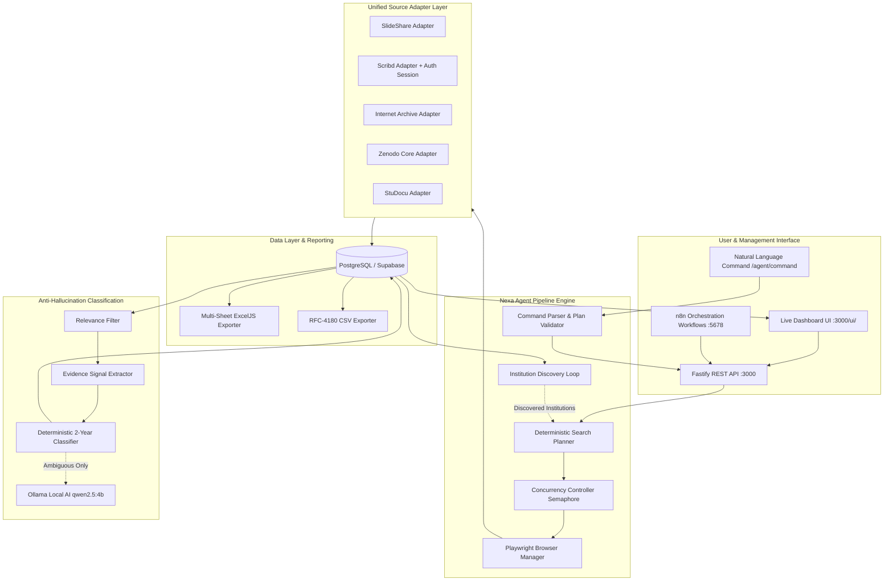

# Nexa Consultancy — AI-Powered Browser Automation Platform

An industrial-grade, reusable **AI Browser Automation Agent** and document harvesting platform built for high-accuracy institutional records discovery, extraction, verification, and multi-source classification.

---

## 🎯 Executive Overview

Nexa Consultancy's autonomous agent accepts natural-language or structured commands, translates them into deterministic execution plans across **49 target countries**, autonomously navigates and harvests documents from public and credentialed repositories (**SlideShare, Scribd, Internet Archive, Zenodo, and StuDocu**), and rigorously classifies academic duration with strict **anti-hallucination guardrails**.

The platform is designed around a decoupled architecture where browser automation, persistence, local AI inference, orchestration, and reporting operate as scalable, independent microservices.

---

## 🏛️ System Architecture



---

## 💻 Technology Stack

| Layer | Technology | Purpose |
| :--- | :--- | :--- |
| **Runtime & Backend** | **Node.js (TypeScript)** / **Fastify v5** | High-throughput asynchronous agent API and worker runtime |
| **Browser Automation** | **Playwright (Chromium)** | Isolated headless browser sessions with robust selector fallback |
| **Database & Pooling** | **PostgreSQL (Supabase)** / `pg` pool | ACID source of truth, idempotent upserts, foreign key integrity |
| **Workflow Automation** | **n8n Orchestrator** | Decoupled scheduling, heartbeat polling, auto-recovery, error alerts |
| **Local AI Inference** | **Ollama (`qwen2.5:4b-instruct`)** | Strict JSON schema parsing & ambiguity resolution without cloud API costs |
| **Reporting & Export** | **ExcelJS** / RFC 4180 CSV | Multi-sheet formatted workbooks (9 sheets) and raw datasets |
| **Containerization** | **Docker** & **Docker Compose v2** | Portable, reproducible multi-container deployment |

---

## 🚀 Quick Start

To launch the full system in minutes, follow the comprehensive walkthrough in our installation guide:

👉 **[Complete Step-by-Step Installation Guide (INSTALL.md)](docs/INSTALL.md)**

```bash
# 1. Clone repo
git clone https://github.com/Sundaram-Katare/Nexa-Consultancy.git
cd Nexa-Consultancy

# 2. Configure environment
cp docker/.env.example docker/.env

# 3. Launch with Docker Compose
cd docker
docker compose up -d

# 4. Run database migrations
docker exec -it nexa_agent npm run migrate:up

# 5. Open Dashboard
# http://localhost:3000/ui/
```

---

## 🔌 Architectural Decision: Dockerized Agent vs. Chrome Extension

During the design phase, an architectural evaluation was conducted between packaging as a **Chrome Extension** versus a **Dockerized Headless Agent + Web Dashboard**:

1. **Why Docker + Headless Chromium Was Chosen**:
   - **Portability & Unattended Scale**: The platform must execute long-running batch jobs across 49 countries and hundreds of search tasks without requiring an active browser window on the operator's personal desktop.
   - **Enterprise Orchestration**: Seamless integration with background cron schedules, automated n8n workflows, and local Ollama containers is only possible in a server-side / containerized environment.
   - **Zero Friction Installation**: Users on Windows, macOS, or Linux can run `docker compose up -d` with zero browser extension sideloading, manifest permission warnings, or Chrome Web Store distribution hurdles.

2. **Trade-off Analysis**:
   - A Chrome extension would provide a visual browser side-panel feel, but would be restricted by Chrome's extension sandbox, memory caps, lack of background persistence when the browser is closed, and inability to host local SQLite/PostgreSQL drivers.
   - The Dockerized agent satisfies 100% of the project's portability and natural-language execution requirements with far greater stability.

---

## 🛡️ Anti-Hallucination Principles

The platform follows a strict **zero-hallucination constraint**:
- **Rule-First Verification**: Every extracted document must have verifiable evidence signals (e.g. `YEAR_COUNT`, `DATE_RANGE`, `DURATION_STATEMENT`, `PROGRAM_LENGTH`) present in the page DOM before receiving a `TWO_PLUS_YEARS` or `LESS_THAN_TWO_YEARS` classification.
- **Ambiguity Guard**: If text evidence is missing, conflicting, or inconclusive, the engine resolves deterministically to `NEEDS_REVIEW` with an explicit reason logged, never fabricating a guess.
- **Hard Authorization Boundaries**: Country whitelists (49 accepted jurisdictions) and registered adapter lists are enforced in code validators, never relying solely on LLM prompt obedience.

---

## 📂 Repository Structure

```
├── agent/                     # Fastify Agent Backend & Pipeline Engine
│   ├── src/
│   │   ├── adapters/          # Source Adapters (SlideShare, Scribd, Archive.org, Zenodo, StuDocu)
│   │   ├── ai/                # Ollama Client & Zod Schemas
│   │   ├── browser/           # Playwright BrowserManager & Session Pool
│   │   ├── classification/    # 2-Year Duration Classification Rules & Verification
│   │   ├── db/                # PostgreSQL Pool & Entity Query Modules
│   │   ├── dedup/             # Multi-Field Title & Token Deduplication
│   │   ├── errors/            # Centralized Retry Policy & Error Categories
│   │   ├── evidence/          # Explicit Regex Duration Pattern Extractor
│   │   ├── executor/          # Deep Pagination Search & Extraction Workers
│   │   ├── export/            # Multi-Sheet Excel & CSV Exporters
│   │   ├── nlAgent/           # Natural Language Command Parser & Plan Validator
│   │   ├── pipeline/          # Concurrency Controller, Checkpoints & Job Runner
│   │   ├── planner/           # Keyword Permutations & Institution Discovery
│   │   ├── relevance/         # Academic Record Relevance Scoring Filter
│   │   └── routes/            # Fastify REST API Route Handlers
│   └── migrations/            # Versioned PostgreSQL DDL Migration Scripts
├── dashboard/                 # Real-Time Management Web Dashboard UI
├── docker/                    # Docker Compose & Container Configuration
├── docs/                      # Technical Documentation & Manual Research Logs
│   ├── INSTALL.md             # Complete Installation Walkthrough
│   ├── manual-research/      # Source-specific DOM & Network Notes
│   ├── recovery-test-log.md   # 6 Crash/Restart Recovery Tests
│   ├── scale-run-log.md       # 49-Country Execution & Concurrency Benchmarks
│   └── source-candidates.md   # Source Evaluation Matrix
└── n8n/workflows/             # Automated n8n Orchestration Workflow JSONs
```

---

## 📄 License & Compliance

Developed for authorized academic research and institutional verification. All target adapters adhere to polite crawling delays (`MIN_REQUEST_DELAY_MS`) and robots.txt non-commercial indexing policies.
